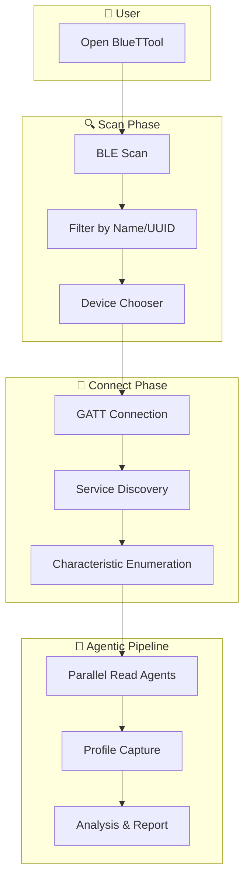
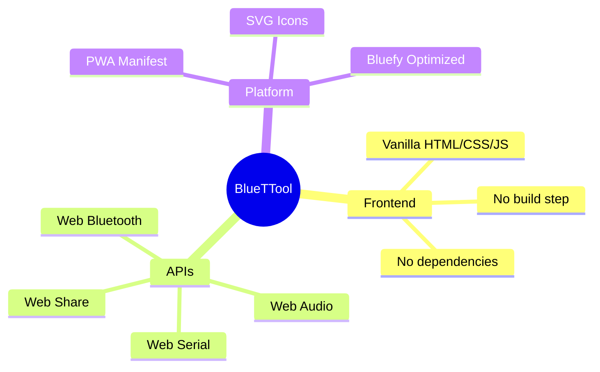
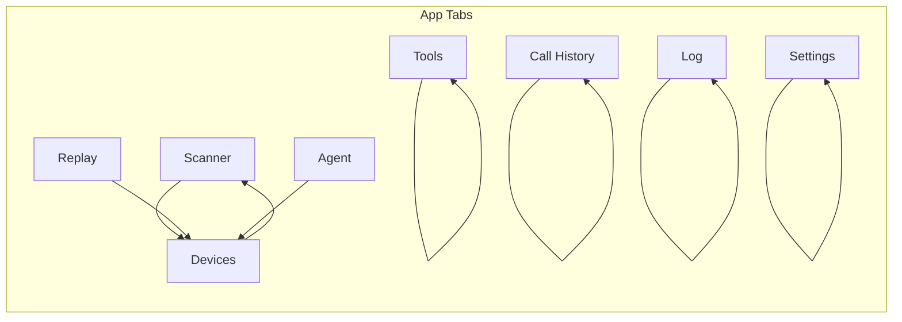

<p align="center">
  
</p>

<p align="center">
  
  
  
  
  
</p>

<p align="center">
  <strong>🎬 THE ULTIMATE BLUETOOTH COMMAND CENTER</strong>
</p>

<p align="center">
  <em>BLE • Classic BT • GATT • DTMF • AirDrop • Agentic Discovery</em>
</p>

<p align="center">
  <a href="https://thumpersecure.github.io/bluettool/"><strong>🚀 LAUNCH APP</strong></a>
  &nbsp;&nbsp;•&nbsp;&nbsp;
  <a href="#-quick-start">Quick Start</a>
  &nbsp;&nbsp;•&nbsp;&nbsp;
  <a href="#-features">Features</a>
  &nbsp;&nbsp;•&nbsp;&nbsp;
  <a href="#-tech-stack">Tech Stack</a>
</p>

---

## 📑 Table of Contents

- [🚀 Quick Start](#-quick-start)
- [📱 Live App](#-live-app)
- [📖 How to Use](#-how-to-use)
- [✨ Features](#-features)
  - [🔍 Scan (BLE)](#-scan-ble)
  - [🔗 Classic Bluetooth](#-classic-bluetooth-chrome-117)
  - [📱 Devices](#-devices)
  - [📞 Call History](#-call-history)
  - [🛠️ Tools Tab](#️-tools-tab)
  - [⚡ Automation Macros](#-automation-macros-tools)
  - [📼 Replay Tab](#-replay-tab)
  - [🔊 Audio Test Tools](#-audio-test-tools)
  - [📤 Share via AirDrop](#-share-via-airdrop)
  - [🤖 Agentic Auto-Discovery](#-agentic-auto-discovery-advanced)
  - [📸 Screenshots](#-screenshots)
  - [📋 Log](#-log)
  - [⚙️ Settings](#️-settings)
- [⚠️ Disclaimer](#️-disclaimer)
- [🛠 Tech Stack](#-tech-stack)
- [📁 Project Structure](#-project-structure)
- [📶 Bluetooth Compatibility](#-bluetooth-compatibility)
- [🔒 Limitations](#-limitations)
- [🐛 Known Issues & Fixes](#-known-issues--fixes)
- [🚢 Deployment](#-deployment)
- [📄 License](#-license)

---

## 🚀 Quick Start

> **⚡ 60-Second Setup** — Get BlueTTool running on your iPhone in under a minute.

```
1. Install Bluefy from App Store
2. Open https://thumpersecure.github.io/bluettool/ in Bluefy
3. Add to Home Screen (Share → Add to Home Screen)
4. Start scanning. You're in.
```

> 💡 **Pro Tip:** Add to Home Screen for a native app experience. No browser chrome, full-screen Bluetooth control.

---

## 📱 Live App

**[https://thumpersecure.github.io/bluettool/](https://thumpersecure.github.io/bluettool/)**

Open this URL in the **Bluefy** browser on your iPhone.

---

## 📖 How to Use

1. Install **[Bluefy](https://apps.apple.com/us/app/bluefy-web-ble-browser/id1492822055)** from the App Store (required for Web Bluetooth on iOS)
2. Open the live app URL in Bluefy
3. **Add to Home Screen** — see [Save to Home Screen with Bluefy](#-save-to-home-screen-with-bluefy) below
4. Start scanning for BLE devices or connect Classic Bluetooth devices (Chrome 117+)

<details>
<summary><strong>📲 Save to Home Screen with Bluefy</strong> (click to expand)</summary>

To save BlueTTool to your iPhone home screen for quick access:

1. Open the app in **Bluefy**
2. Tap the **Share** button (square with arrow) in Bluefy's toolbar
3. Scroll down and tap **Add to Home Screen**
4. Tap **Add** to confirm

The app will open like a native app from your home screen. The in-app Scanner tab also includes step-by-step instructions.

</details>

---

## ✨ Features

### 🔍 Scan (BLE)

| Capability | Description |
|------------|-------------|
| 🔎 **Discover** | Find nearby BLE devices via the Web Bluetooth API |
| 🎯 **Filter** | Filter by device name prefix or service UUID |
| 🌐 **Accept-All Mode** | Broad discovery for maximum coverage |
| 🏷️ **Device Names** | Prominent display alongside browser-generated IDs |
| ✅ **Compatibility** | Built-in browser compatibility checker |

### 🔗 Classic Bluetooth (Chrome 117+)

| Capability | Description |
|------------|-------------|
| 🔌 **Connect** | Pair with Bluetooth Classic devices via Web Serial API |
| 📡 **RFCOMM/SPP** | Full Serial Port Profile support |
| 🚀 **Quick Access** | "Connect Classic BT Device" in Scanner tab on Chrome 117+ |

### 📱 Devices

| Capability | Description |
|------------|-------------|
| 📋 **Device List** | View all discovered devices with names, IDs, connection status |
| 🔄 **Refresh** | Refresh the device list without rescanning |
| 📊 **Sort** | Sort by newest, oldest, or name (A–Z / Z–A) |
| 🔍 **Filter** | Filter by all, connected only, or available devices |
| 🔗 **GATT Profile** | Connect and enumerate full GATT profile |
| ✏️ **Read/Write** | Read, write, and subscribe to individual characteristics |
| 📸 **Snapshots** | Capture device profile snapshots from the detail panel |
| 📤 **Export** | Export discovered device list as CSV |

### 📞 Call History

| Capability | Description |
|------------|-------------|
| 📥 **Import** | From CSV or JSON files |
| 📤 **Export** | To CSV for backup |
| 📋 **Formats** | `date,number,duration,type` (CSV) or JSON array |
| 📱 **iPhone Data** | Use a call history backup app, then import the exported file |

### 🛠️ Tools Tab

The **Tools** tab groups audio, lights, silence, and sharing controls:

| Section | Description |
|---------|-------------|
| 🔊 **Sound** | DTMF/fax tones, play file, stop audio — see [Audio Test Tools](#-audio-test-tools) |
| 💡 **Lights** | Flash, turn off, or set color on connected smart lights (Govee, etc.) |
| ⚡ **Macros** | Chain actions into one-tap sequences — see [Automation Macros](#-automation-macros-tools) |
| 🔇 **Silence** | Stop all audio and disconnect BLE devices (silence Bluetooth speakers) |
| 📤 **Share** | AirDrop/share via iOS share sheet — see [Share via AirDrop](#-share-via-airdrop) |

### ⚡ Automation Macros (Tools)

| Capability | Description |
|------------|-------------|
| 📋 **Step types** | `delay` (wait ms), `light_flash`, `light_off`, `light_color`, `replay` (capture), `connect_device` |
| ▶️ **Run** | Execute a macro with one tap — runs steps in sequence across connected devices |
| ➕ **Add Macro** | Create a preset: delay → flash → delay → off (or customize steps) |
| 🗑️ **Delete** | Remove macros with confirmation |

Connect smart lights in the Devices tab first. Macros support `deviceId: 'all'` for parallel multi-device light control (flash all, set color on all, etc.).

### 📼 Replay Tab

| Capability | Description |
|------------|-------------|
| 📋 **Captured Profiles** | List of GATT snapshots captured from the Devices tab detail panel |
| ▶️ **Replay** | Replay captured characteristic data to a connected device (with safety checks) |
| 📭 **Empty State** | Prompts to capture from Devices tab when no captures exist |

### 🔊 Audio Test Tools

| Tool | Description |
|------|-------------|
| 🎵 **Play DTMF Tones** | Live-generated fax/DTMF tone sequence via Web Audio API |
| 📁 **Play Audio File** | Plays included WAV file of fax machine / DTMF tones (falls back to live DTMF if missing) |
| ⏹️ **Stop All Audio** | Instantly stops any playing audio |
| 🔇 **Silence All** | Stops audio AND disconnects all BLE devices (silences Bluetooth speakers) |

### 💡 Smart Lights (Tools)

| Tool | Description |
|------|-------------|
| ⚡ **Flash All Lights** | Flash all connected smart lights (Govee, etc.) |
| 🔴 **Turn Off All Lights** | Turn off all connected smart lights |
| 🎨 **Set Color on All Lights** | Set RGB color on all connected color-capable lights |

Connect devices in the Devices tab first. Per-device Flash/Color/Off controls appear in the device list and detail panel for compatible lights.

### 📤 Share via AirDrop

| Action | Description |
|--------|-------------|
| 📤 **Share DTMF Audio File** | Send the fax tones WAV via iOS share sheet / AirDrop |
| ❤️ **Share Random Hearts** | Send a burst of random heart emojis |
| 🔗 **Share App Link** | Share the BlueTTool URL |

### 🤖 Agentic Auto-Discovery (Advanced)

> **🎯 Automated BLE discovery pipeline** with bounded parallel read agents.

```
Scan → Connect → Enumerate → Read (parallel) → Capture → Analyze
```

1. **Scan** — Broad BLE scan to find nearby devices
2. **Connect** — Establish GATT connection
3. **Enumerate** — Discover all services and characteristics
4. **Read** — Fan out readable characteristic checks across multiple parallel agents (bounded for stability)
5. **Capture** — Snapshot the full device profile
6. **Analyze** — Report findings, surface areas, and recommendations

Real-time status feed shows each step as it executes.

**Parallel Multi-Device Discovery** — Analyze all discovered devices simultaneously. Run a BLE scan first, then tap "Run Parallel Discovery" to connect, enumerate, and assess each device concurrently. Aggregate results and vulnerability reports are shown when complete.

<details>
<summary><strong>📊 Architecture Diagram</strong> (click to expand)</summary>



</details>

### 📸 Screenshots

> *Screenshots coming soon. In the meantime, here's what BlueTTool looks like in action:*

```
┌─────────────────────────────────────┐
│  🔵 BlueTTool          [≡] [···]   │
├─────────────────────────────────────┤
│  Scan │ Devices │ Tools │ Replay │ Calls │ Agent │ Log │ Settings │
├─────────────────────────────────────┤
│                                     │
│  📡 BLE Scan                        │
│  ┌─────────────────────────────┐   │
│  │  Start Scan                  │   │
│  └─────────────────────────────┘   │
│                                     │
│  📱 Discovered Devices              │
│  • Device_A (RSSI: -65)             │
│  • Device_B (RSSI: -72)             │
│  • Device_C (RSSI: -81)             │
│                                     │
│  [Connect] [Export CSV]             │
│                                     │
└─────────────────────────────────────┘
```

### 📋 Log

- Timestamped activity log for every operation
- Copy full log to clipboard for reporting

### ⚙️ Settings

- **Appearance** — Dark/light theme toggle
- **Audio** — Persist volume level across sessions
- **Scan** — Scan timeout hint (seconds)
- **Device List Defaults** — Default sort (newest/oldest/A–Z/Z–A) and filter (all/connected/available)
- Reset to defaults

---

## ⚠️ Disclaimer

> ⚠️ **IMPORTANT — READ BEFORE USE**
>
> **This tool is provided for educational purposes, personal device management, and authorized security testing only.**

- ✅ Only use BlueTTool with devices you own or have explicit permission to test
- ❌ Do not use this tool to access, disrupt, or interfere with devices belonging to others
- 📜 The authors are not responsible for misuse of this tool
- ⚖️ Comply with all applicable local, state, and federal laws regarding Bluetooth and wireless communications
- 🔊 The "Stop Music" / "Silence All" feature is designed for managing your own Bluetooth speakers

> **Personal use only.** This tool is strictly for testing, learning about, and managing your own Bluetooth devices. It is not intended for unauthorized access, disruption of devices you do not own, or any activity that violates applicable laws. Use responsibly for education, personal convenience, and authorized security testing only.

---

## 🛠 Tech Stack



| Layer | Technology |
|-------|------------|
| **Frontend** | Vanilla HTML/CSS/JS — no build step, no dependencies |
| **BLE** | Web Bluetooth API (GATT) |
| **Classic BT** | Web Serial API (Chrome 117+) |
| **Audio** | Web Audio API (DTMF tone generation) |
| **Sharing** | Web Share API (AirDrop / native sharing) |
| **PWA** | Manifest with SVG icons |
| **Target** | Optimized for Bluefy browser on iOS |

---

## 📁 Project Structure

```
bluettool/
├── index.html              # Main app shell
├── manifest.json           # PWA manifest
├── sw.js                   # Service worker
├── css/
│   └── style.css           # Dark theme, mobile-first styles
├── js/
│   ├── logger.js           # Centralized activity logger
│   ├── browser-compat.js   # Browser/feature detection (Bluefy vs Chrome)
│   ├── call-history.js     # Call history import/export
│   ├── bluetooth-scanner.js # Web Bluetooth (BLE) engine
│   ├── serial-bluetooth.js # Classic Bluetooth (Web Serial)
│   ├── announcements.js    # Capture & replay module
│   ├── audio-player.js     # DTMF/fax tone audio player
│   ├── vulnerability.js    # GATT security assessment
│   ├── advanced.js        # Agentic auto-discovery engine
│   ├── sharing.js         # AirDrop / Web Share module
│   └── app.js             # Main controller wiring UI to modules
├── audio/
│   └── dtmf-fax-tones.wav  # Pre-generated DTMF/fax tones
├── scripts/
│   └── generate-dtmf-wav.js # Generate audio file
└── icons/
    ├── icon-180.svg        # Apple touch icon
    ├── icon-192.svg       # PWA icon
    └── icon-512.svg       # PWA icon large
```

<details>
<summary><strong>📐 App Flow Diagram</strong> (click to expand)</summary>



</details>

---

## 📶 Bluetooth Compatibility

| Feature | Bluefy (iOS) | Chrome 117+ | Safari |
|---------|--------------|-------------|--------|
| **BLE (Web Bluetooth)** | ✅ Works | ✅ Works | ❌ No |
| **Classic BT (Web Serial)** | ❌ No | ✅ Works | ❌ No |

- **iPhone/Bluefy:** BLE only. Classic BT is not supported (Web Serial is not in Bluefy/Safari).
- **Chrome 117+:** Full support — BLE and Classic BT (RFCOMM/SPP).
- **Safari:** No Web Bluetooth. Use Bluefy on iOS or Chrome on desktop.

The app applies **graceful degradation**: the Classic BT button is disabled in Bluefy with the message *"Classic BT requires Chrome 117+"*. See [RECOMMENDATIONS.md](RECOMMENDATIONS.md) for detailed guidance and workarounds.

---

## 🔒 Limitations

| Limitation | Notes |
|------------|-------|
| **Bluefy required on iOS** | Safari does not support Web Bluetooth |
| **Classic BT requires Chrome 117+** | Not available in Bluefy or Safari |
| **No passive scanning** | Each scan requires user interaction with the browser's device chooser |
| **Device IDs** | Browser-generated; real MAC addresses hidden for privacy |
| **BLE vs Classic** | BLE uses GATT; Classic uses Web Serial (Chrome 117+) |
| **No raw advertisement access** | Capture/replay works at GATT characteristic level |
| **AirDrop sharing** | Requires iOS and Web Share API support in Bluefy |
| **Call history** | Import only; no direct sync from iPhone (requires third-party export) |

---

## 🐛 Known Issues & Fixes

| Issue | Status |
|-------|--------|
| Missing audio file (404) | ✅ Fixed — `audio/dtmf-fax-tones.wav` generated by script; fallback to live DTMF if missing |
| Scan failures show no toast | ✅ Fixed — toasts now shown on cancel/error |
| Share actions show no feedback | ✅ Fixed — success/error toasts added |
| Deprecated `substr` | ✅ Fixed — replaced with `substring` |
| Logger `escapeHtml` undefined | ✅ Fixed — null/undefined guard added |
| Agent results TypeError | ✅ Fixed — defensive array checks in `renderAgentResults` |
| Confirm dialog no overlay dismiss | ✅ Fixed — click overlay to dismiss |
| Null reference risks | ✅ Fixed — optional chaining on DOM elements |

---

## 🚢 Deployment

> 📦 **GitHub Pages** — For GitHub Pages or similar deployment, use the **default branch** for the repo (e.g. configure Pages to deploy from the default branch rather than hardcoding `main`).

---

## 📄 License

**MIT** — Use freely. Build something amazing.

---

<p align="center">
  <strong>BlueTTool</strong> — <em>Your Bluetooth. Your devices. Your command center.</em>
</p>

<p align="center">
  <sub>Made with ⚡ for the Bluetooth curious</sub>
</p>
